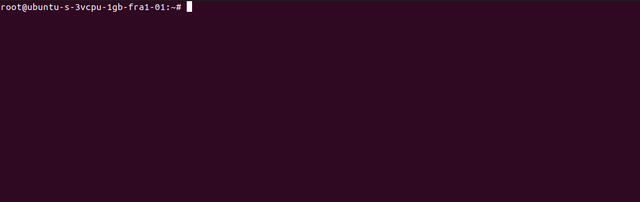

# Notes on Jenkins and Nexus

## Installation 

For quick deployment use [Gianpaolo Macario's](https://github.com/gmacario/easy-jenkins) `easy-jenkins`:

```bash
git clone https://github.com/gmacario/easy-jenkins
cd easy-jenkins
./runme.sh
```

## Running Jenkins on an public cloud's instance  

In my case I am running an Linux VM instance in [Digital Ocean](https://www.digitalocean.com/). This should not make any difference with other cloud providers as for example [AWS's EC2](https://aws.amazon.com/ec2/) or [Google Cloud's Compute engine](https://cloud.google.com/compute). 

**Steps** 
1. Connect with SSH to your VM instance. Note: For some cloud platforms this will require to install a provider's [SDK](https://en.wikipedia.org/wiki/Software_development_kit).
2. Do the `Installation` step. It will provide an initial admin password.
3. Check if the docker image was succesfully built and the container is running
 
4. Eventually can run commands in your container with: 
    ```bash
    docker exec -it easy-jenkins_myjenkins_1 bash
    ``` 
5. Run jenkins in your browser to the URL: ```<host>:<jenkins_port>```. 
6. Set up your admin account. 
7. You are good to go.  

